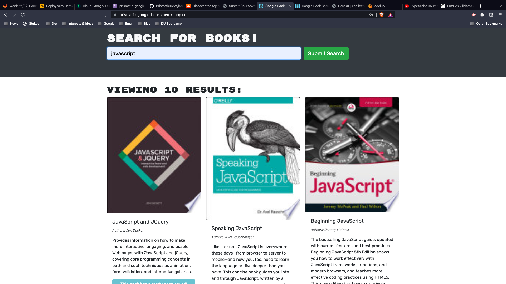
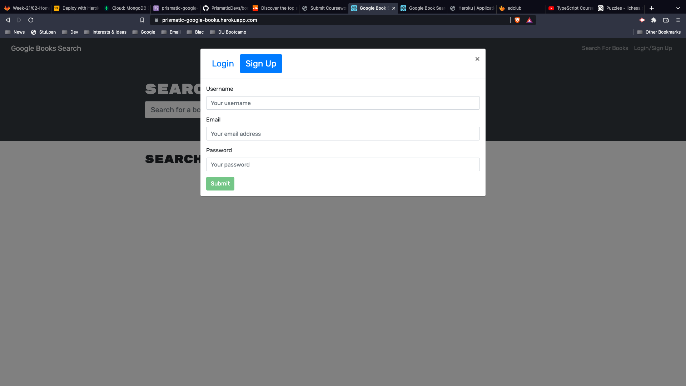
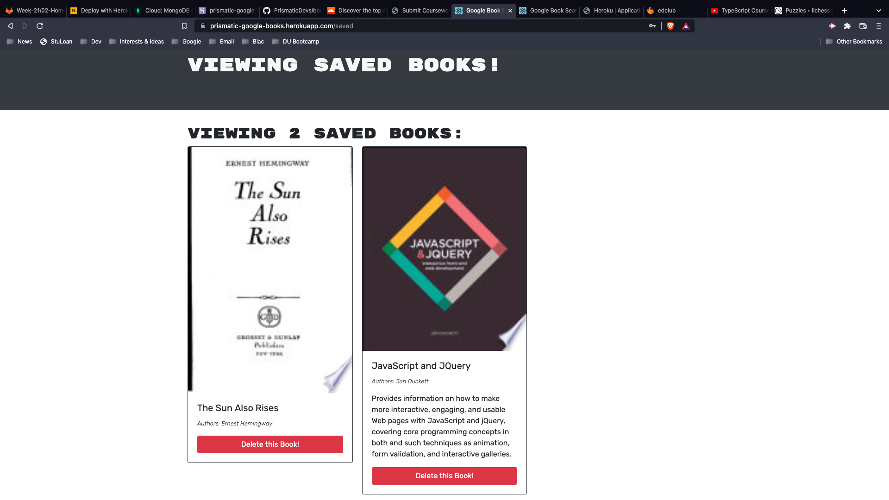

# Book Search Engine

## Table of Contents

- [License](#license)
- [Description](#description)
- [Installation](#installation)
- [Usage](#instructions)
- [Contributors](#contributors)
- [Testing](#testing)
- [Questions](#questions)

## License

## Description

This application uses the Google book search API to search for books and this app allows users to log in and save books'

## Installation

This app is live on heroku, no need to install'

## Usage

Type the book that you want to search for and then the API will find it for you.

Create an account.

Log in to your account in order to save books you have searched. You can also remove books from your saved books list.

## Contributors

University of Denver

## Testing

n/a

## Questions

Contact me:
Github: [PrismaticDevs](https://github.com/PrismaticDevs)  
Email: matthewbrignola@gmail.com  
Phone: 7193515828  
